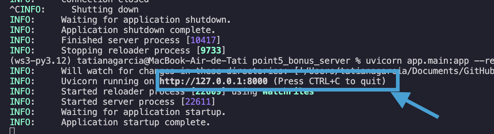
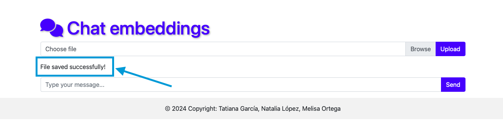

# Chat Application with Embedding Generation

This is a chat application that leverages embeddings to provide intelligent responses. It utilizes pre-trained models to generate embeddings for incoming messages and and retrieve the most relevant responses from a pre-loaded text file. Here's how to set it up:

### Prerequisites:

- Python 3.9 or higher installed
- Poetry package manager installed, run this command:

```bash
pip install poetry
```

### Installation:

1. Clone this repository to your local machine:

```bash
git clone git@github.com:TatianaGarcia1128/ws_embeddings_project.git
```

2. Navigate to the project directory:

```bash
cd ws_embeddings_project
```

3. Navigate to the application directory:
```bash
cd point5_bonus_server
```

4. Activate Virtual Enviroment:
```bash
poetry shell
```

5. Install dependencies using Poetry:

```bash
poetry install
```

If you have problems, delete the poetry.lock file and run the installation command again.


### Running the Application:

To start the chat application, use Uvicorn. Run the following command:

```bash
uvicorn app.main:app --reload
```

Open the link shown in the console with Ctrl + click on that path:



Select the file, click the Upload button and wait for the following success message to appear:



**Note:** Only files in .txt format are allowed.

Ask a question, click the Send button and wait for the top 3 results to appear:


**Note:** You can ask several questions about the upload document. For the sample_1.txt file the following questions are suggested:
- "How does machine learning help businesses?"
- "How does machine learning improve financial services?",
- "What are the strengths of supervised learning?",
- "How does unsupervised machine learning differ from supervised learning?

**Remember:**
If you want to make a new query with another file you must refresh the page.